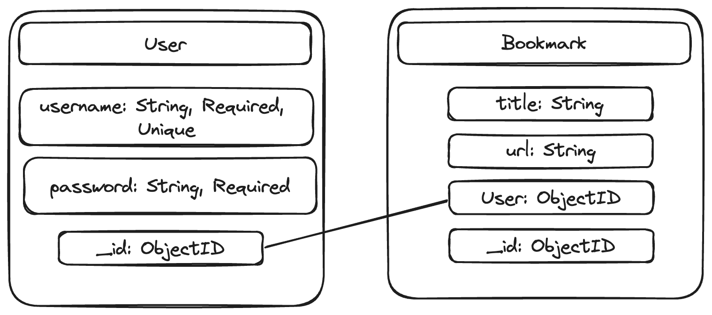

# Backend Bookmark Boys

- **Alex Greenberg**
- **Rohan Sinha**
- **Nicholas Murray**
- **Daniel Ji**

- **The Bookmarker will help us store useful links to our coding journey**

- **https://github.com/rohansinha01/backend-bookmark**
- **https://backend-bookmark.onrender.com*
- **https://trello.com/b/aCHcIV1x/project-3-seal**

## List of Dependencies

##### Node Dependencies

- express
- mongoose
- morgan
- bcrypt

## Backend Route Map

| Route Name | Endpoint | Method | Description |
|------------|----------|--------|-------------|
| Bookmark Index | /bookmark    | GET    | Renders all of the bookmarks on a page |
| New Bookmark Form | /bookmark/new   | GET    | Renders a form to add a new bookmark |
| Create Bookmark | /bookmark    | POST    | Creates the new bookmark from the form |
| Edit Bookmark Form | /bookmark/:id/edit    | GET    | Renders a form to edit an existing bookmark |
| Update Bookmark | /bookmark/:id   | PUT    | Updates the existing bookmark from the form  |
| Remove Bookmark | /bookmark/:id   | DELETE    | Deletes the bookmark selected |
| Show Bookmark | /bookmark/:id    | GET    | Renders a detailed page of the bookmark |

## ERD (Entity Relationship Diagram)

